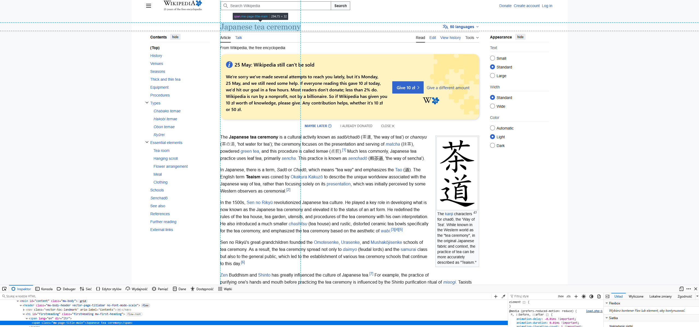
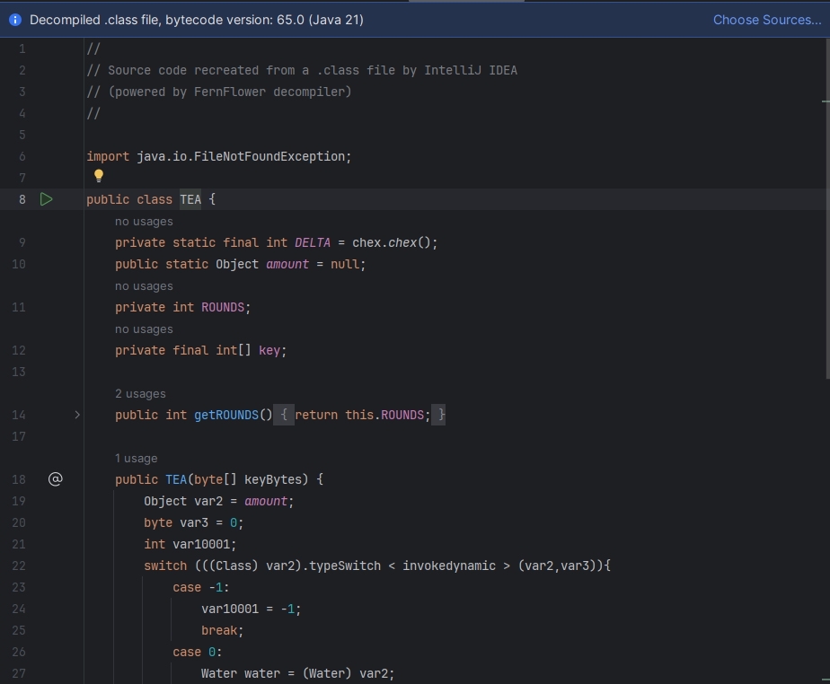

# HiddenTeaLover

```
Cryptography

Difficulty: Hard (brak rozwiazan)
Author: Jakub Rawski

A certain tea maker Chex has hidden the way to make the perfect tea.
Your task is to decipher his secret which he has hidden using
the oldest possible tools which are connected with his passion

His encrypted secret has 32 chars and its connected with his name
```


Tar zawiera 5 roznych plikow:
 - TEA.jar
 - secret.tea
 - recipe.tea
 - key.notea
 - chex.chex

Zawartosc chex.chex:
```
1: 0E8D7E91
2: 12E4B564
3: 740AA713
4: 36ECE157
5: 91DE051D
6: 1AF9122D
7: 2E09FB40
8: 63686578
9: DD948816
10: EAE67BD7
11: 45178D11
12: F048E487
13: 58033218
14: 637DE3AA
....
```
Widac ze kazdy numer ma inny przydzial znakow szestnastkowych

Zawartosc key.notea:
```
class getKey()
    def getKey()
        link = openFromNet("https://en.wikipedia.org/wiki/Japanese_tea_ceremony")
        key = link.getTitle()
        key.strip("_")
	key.toLoverCase()
        key.remove("tea")
        return key

```
Widzimy ze jest to pseudo-kod

Zrobmy recznie te kroki i zobaczmy co wyjdzie:

Zparsujmy teraz tytul `Japanese tea ceremony`:

```
strip("Japanese tea ceremony") -> lower("Japaneseteaceremony") -> remove("japaneseteaceremony","tea) -> japanseceremony
```
Zapamiejamy slowo `japanseceremony`, przyda sie pozniej.


Zawartosc secret.tea:

```
AaRqq_9Hvk9w/uO#AAyq>7;1f|mz^n,h&m$9A'OJ-I6DgMzY*FPOp9():ds@K]>6aJ[.]v1|xj,i9Yo3R1?=01-$9{z&A,Z8gOS8mUOiC3nC00QTz/|d6HN!gLVk:|3NdO'rq%lsc}b.0H|c7?W3ZF<pW8m&t890?aU$Iz>O
Bo}kvm^Hcu}Q(XS3@SEn8Bebqm;4_JL>W[}OQLAS-D8GD?v4/Ee)sO}HWpS5GH84nL7?:+#YKIdG9r@L^DRSBMiD6|K/jQuVMDU7P%z{g1eei7b&i,-kK6H/}MG+t716;yW%w>(fOKAmN3IY3DJESc1VGrY<,-r4Nq9SwPmR
8{yaI%>6X+r^eWs9Mab(v1-:_sSnRU%A)y>fRV=]jPCT,{]p%](;>6XzJQ6=6e%A:*#-_(%rLpg{.oL!G1IiC$<PO,l,MbrP:]HdTRLnP1/lLsbqeGpaOQu9i+-$aa2FVB-$,Gut+E=IH=hd7-%3g%07iHBDRUTHAwAb7+wv
5|YY+IHnQi3tV4/!-]$KA3{:z3r>vQj5r=R3x9Fp5E6ztd'p&#?Kupb)VEEA>M:2?d=Tip>U:0G]ICk!D=FFF;8,kn$zd_xrb-Mg>)W[{9P{#/b3jR@@z.u!TzG$wTC^+v(wZfGxGMuse2MLW2nERu-Bo426rEl*brc/87$x
FW<0rn$#1Kn1b<F:v)%&$AkIys6>d&cMvlxuu+e/s%6|U,S}iy-qr/hMn'Kuk3s8]D[VS[dc49w6M;ylDQW91'|0EJs9qV<i9h;P?F)yhBC3<=-AvSKrL*8xQBprqLE8ouW>8NI-U3r7X4By#PC71:iTJdct7P2@O'KxYT=3
5GC&_WuP5Kn)xVP(YXOzi7iT[=5Gmz[9dITz2o$3lZA8uf'k%a'8q^h%Nh;q|#T7e;IayLnZvCB{F*))e]'u4RH8,q!84i5O&@+k&l{s02{?HB,*8t{<y?I<)cM&QY50HUR1}5pK9@r0XrgA4v^0qMTzM+5jO^[e6BC5f]Z:

```
Zawartosc secret.tea:
```
CERoWZn[/g&{r&YaS-tAYu4Gl,9aDOt#Pi+bo3}nc's.X S5y:joeVu/Q L&hmwa4$v0:eXK nlfB<iWpg4euUKr#QeQQdiS <Wo{TuUZtpc U.tL9h'?aS0t6# (Ftvye;?a<M Xmn.beGxeJ?d^Uss! pnwTvaz_tCueNtr*| QHbt.u4+t>j :HdC0o53 %wnp2o>*t8- YBfoTo^rr?@g/0efGt9E q9a|=bwFo_MuIvtg& 0.smkuc@gutaf7rmI UFa8-d5:d}d OGa,isfA Zjm&^a4hnTHyL' {4sJ3pgNopBo,:niJsdH [=a;5sYD BEtnqhHWe$2 ^Ba?JmJ<o'buc&ndntsG 6=t24oOm .hbKpej{ 7(c/xoK+n6asUlil.sjdtTgez6n^2ti| |YwROiu}tZZhqC hEm(0yzO M^vHveY/rf(s.7iP+oU/nm6 /^oNAf,@ X9tEZhZyeU: l&r_yeYScV6iFUp}CeJ2 F_dLUiY$s}6t,KrZ.i)'bv5unYtg]iCBovjnjd
```
Nic z tego na razie nie da sie rozczytac

Zobaczmy co w sobie ma bibioteka


Zawartosc TEA.jar:
```
class chex {
    chex() {
    }

    public static int chex() {
        int chex = 0;
        return chex;
    }
}

class Sugar {
    public static Integer amountOfSugar = 3;

    Sugar() {
    }

    public int tablespoon() {
        return amountOfSugar;
    }
}

import java.io.FileNotFoundException;

public class TEA {
    private static final int DELTA = chex.chex();
    public static Object amount = null;
    private int ROUNDS;
    private final int[] key;

    public int getROUNDS() {
        return this.ROUNDS;
    }

    public TEA(byte[] keyBytes) {
        Object var2 = amount;
        byte var3 = 0;
        int var10001;
        switch (((Class)var2).typeSwitch<invokedynamic>(var2, var3)) {
            case -1:
                var10001 = -1;
                break;
            case 0:
                Water water = (Water)var2;
                var10001 = 0;
                break;
            case 1:
                Sugar sugar = (Sugar)var2;
                var10001 = sugar.tablespoon();
                break;
            default:
                throw new IllegalStateException("Unexpected value: " + String.valueOf(amount));
        }

        this.ROUNDS = var10001;
        if ((double)keyBytes.length != ((26.0 - Math.sqrt(81.0)) * 2.0 - Math.pow(4.0, 2.0) / 2.0 + 21.0 - 15.0) / 2.0) {
            throw new IllegalArgumentException("");
        } else {
            this.key = new int[4];

            for(int i = 0; i < 4; ++i) {
                this.key[i] = (keyBytes[i * 4] & 255) << 24 | (keyBytes[i * 4 + 1] & 255) << 16 | (keyBytes[i * 4 + 2] & 255) << 8 | keyBytes[i * 4 + 3] & 255;
            }

        }
    }

    public int[] encrypt(int cup, int tea) {
        int water = 0;

        for(int i = 0; i < this.ROUNDS; ++i) {
            water += DELTA;
            cup += (tea << 3) + this.key[0] ^ tea + water ^ (tea >>> 6) + this.key[3];
            tea += (cup << 2) + this.key[1] ^ cup + water ^ (cup >>> 7) + this.key[2];
        }

        int[] cup_of_tea = new int[]{cup, tea};
        return cup_of_tea;
    }

    public int[] decrypt(int v0, int v1) {
        return null;
    }

    public static void main(String[] args) throws FileNotFoundException {
        String keyString = "xxKey.getKey()xx";
        byte[] key = keyString.getBytes();
        TEA tea = new TEA(key);
        if (tea.getROUNDS() < 0) {
            throw new RuntimeException("too low amount of water");
        } else if (tea.getROUNDS() == 0) {
            Water.message();
        } else {
            int[] code1 = tea.decrypt(1, 2);
            int[] code2 = tea.decrypt(3, 4);
            int[] code3 = tea.decrypt(5, 6);
            System.out.printf("Encrypted: %08X%08X%08X%08X%08X%08X%n", code1[0], code1[1], code2[0], code2[1], code3[0], code3[1]);
        }
    }
}

import java.io.File;
import java.io.FileNotFoundException;
import java.util.Scanner;

class Water {
    static String file = "recipe.tea";

    Water() {
    }

    public static void message() throws FileNotFoundException {
        File myObj = new File(file);
        String wholeText = "";

        Scanner myReader;
        String data;
        for(myReader = new Scanner(myObj); myReader.hasNextLine(); wholeText = wholeText + data) {
            data = myReader.nextLine();
        }

        StringBuilder output = new StringBuilder();

        for(int i = 0; i < wholeText.length(); i += Sugar.amountOfSugar) {
            output.append(wholeText.charAt(i));
        }

        System.out.println(output.toString());
        myReader.close();
    }
}
```

Gdy skompilujemy kod dostaniemy wynik:
`Exception in thread "main" java.lang.RuntimeException: too low amount of water at TEA.main(TEA.java:103)`

Dostajemy taki wynik poniewaz `public static Object amount = null;`

Wrzucmy tam obiekt typu Water by switch ustawil val10001 na 0
`public static Object amount = new Water();`

mozna tez zrobic recznie w nastepujacy sposob:
```
public TEA(byte[] keyBytes) {
        Object var2 = amount;
        byte var3 = 0;
        int var10001;
        /*
        switch (((Class)var2).typeSwitch\<invokedynamic>(var2, var3)) {
            case -1:
                var10001 = -1;
                break;
            case 0:
                Water water = (Water)var2;
                var10001 = 0;
                break;
            case 1:
                Sugar sugar = (Sugar)var2;
                var10001 = sugar.tablespoon();
                break;
            default:
                throw new IllegalStateException("Unexpected value: " + String.valueOf(amount));
        }
         */
        var10001 = 0;
        this.ROUNDS = var10001;
        if ((double)keyBytes.length != ((26.0 - Math.sqrt(81.0)) * 2.0 - Math.pow(4.0, 2.0) / 2.0 + 21.0 - 15.0) / 2.0) {
            throw new IllegalArgumentException("");
        } else {
            this.key = new int[4];

            for(int i = 0; i < 4; ++i) {
                this.key[i] = (keyBytes[i * 4] & 255) << 24 | (keyBytes[i * 4 + 1] & 255) << 16 | (keyBytes[i * 4 + 2] & 255) << 8 | keyBytes[i * 4 + 3] & 255;
            }

        }
    }
```
Po uruchomieniu dostajemy komunikat:
`Congratulations you have figured out that tea needs water but do not forget about sugar add as many spoons as the amount to be consistent with my version of the recipe distribution`

Mozna sprawdzic wersje javy zagladajac do Pliku .class
(InteliJ tutaj zrobil to za mnie)


Wiemy teraz ze to 21.

Ustawmy teraz tam gdzie to ma znaczenie:

```
class Sugar {
    public static Integer amountOfSugar = 21;

    Sugar() {
    }

    public int tablespoon() {
        return amountOfSugar;
    }
}

```
Wrocmy do pliku chex.chex:

```
17: 091D1D48
18: 8AEBEA93
19: 6F4761C4
20: 7C3A4B08
21: 63686578
22: 827B467E
23: B07E3135
```
Pozycja 21 ma wartosc `63686578`
Odkodowujac to w ASCII mamy `chex`, jako ze 
`His encrypted secret has 32 chars and its connected with his name`
Moze podpowiadac ze to sa te wartosci

WAZNE: ustawic jako wartosc HEX a nie DEC

```
class chex {
    chex() {
    }

    public static int chex() {
        int chex = 0x63686578;
        return chex;
    }
}
```
Zobaczmy metode main w klasie TEA:

```
public static void main(String[] args) throws FileNotFoundException {
        String keyString = "xxKey.getKey()xx";
        byte[] key = keyString.getBytes();
        TEA tea = new TEA(key);
        if (tea.getROUNDS() < 0) {
            throw new RuntimeException("too low amount of water");
        } else if (tea.getROUNDS() == 0) {
            Water.message();
        } else {
            int[] code1 = tea.decrypt(1, 2);
            int[] code2 = tea.decrypt(3, 4);
            int[] code3 = tea.decrypt(5, 6);
            System.out.printf("Encrypted: %08X%08X%08X%08X%08X%08X%n", code1[0], code1[1], code2[0], code2[1], code3[0], code3[1]);
        }
    }
}
```
Sprawdzmy czy klucz spelnia zalozenie
```
        if ((double)keyBytes.length != ((26.0 - Math.sqrt(81.0)) * 2.0 - Math.pow(4.0, 2.0) / 2.0 + 21.0 - 15.0) / 2.0) {
            ...

```
Wynik to `16`, czy tyle ile znakow ma nasz kandydat na klucz.

Mozemy od razu ustawic znaleziony klucz `japaneseceremony`

Zobaczmy metode encrypt i decrypt:
```
public int[] encrypt(int cup, int tea) {
        int water = 0;

        for(int i = 0; i < this.ROUNDS; ++i) {
            water += DELTA;
            cup += (tea << 3) + this.key[0] ^ tea + water ^ (tea >>> 6) + this.key[3];
            tea += (cup << 2) + this.key[1] ^ cup + water ^ (cup >>> 7) + this.key[2];
        }

        int[] cup_of_tea = new int[]{cup, tea};
        return cup_of_tea;
    }

public int[] decrypt(int v0, int v1) {
        return null;
    }
```
Dla osob ktore widzialy rozne metody szyfrowania moga sie zoorietowac
ze jest to algorytm TEA z malymi zmianami

Tutaj bloki sa nierownomiernie przestawiane wiec dekoder tea nie zadziala
Napiszmy metode ktora robi w "odwrotna strone" to co robi metoda encrypt:
```
public int[] decrypt(int v0, int v1) {
        int sum = DELTA * ROUNDS;
        for (int i = 0; i < ROUNDS; i++) {
            v1 -= ((v0 << 2) + key[1]) ^ (v0 + sum) ^ ((v0 >>> 7) + key[2]);
            v0 -= ((v1 << 3) + key[0]) ^ (v1 + sum) ^ ((v1 >>> 6) + key[3]);
            sum -= DELTA;
        }
        return new int[]{v0, v1};
    }
```

Przyjrzyjmy sie jak Klasa Water rozszyfrowala popowiedz z recipe.tea:


```
public static void message() throws FileNotFoundException {
        File myObj = new File(file);
        String wholeText = "";

        Scanner myReader;
        String data;
        for(myReader = new Scanner(myObj); myReader.hasNextLine(); wholeText = wholeText + data) {
            data = myReader.nextLine();
        }

        StringBuilder output = new StringBuilder();

        for(int i = 0; i < wholeText.length(); i += Sugar.amountOfSugar) {
            output.append(wholeText.charAt(i));
        }

        System.out.println(output.toString());
        myReader.close();
    }
```
Widzimy ze co ktoras litera jest brana

Wczesniej byla co 3, teraz sprobojmy brac co 21 znak:
```
import java.io.BufferedReader;
import java.io.FileReader;
import java.io.IOException;

public class Decoder {

    static final int STEP = Sugar.amountOfSugar;

    public static String decode(String encoded) {

        StringBuilder decoded = new StringBuilder();

        for (int i = 0; i < encoded.length(); i += STEP) {
            decoded.append(encoded.charAt(i));
        }

        return decoded.toString();
    }

    public static void main(String[] args) {

        String filePath = "secret.tea";

        try (BufferedReader reader = new BufferedReader(new FileReader(filePath))) {

            String line;

            while ((line = reader.readLine()) != null) {

                String decoded = decode(line);

                System.out.println("Encrypted: " + decoded);
            }

        } catch (IOException e) {
            e.printStackTrace();
        }
    }
}
```

Da nam wynik:
```
Encrypted: A7660333
Encrypted: BB84B11E
Encrypted: 81CAC123
Encrypted: 5362F9CE
Encrypted: FA681BE7
Encrypted: 57A74250
```
Wszystko to znaki szestnastkowe!

Dajmy je w kolenosci od 1 do 6 do tea.decrypt()"

```
public static void main(String[] args) throws FileNotFoundException {
        String keyString = "japaneseceremony";
        byte[] key = keyString.getBytes();
        TEA tea = new TEA(key);
        int c1 = 0xA7660333;
        int c2 = 0xBB84B11E;
        int c3 = 0x81CAC123;
        int c4 = 0x5362F9CE;
        int c5 = 0xFA681BE7;
        int c6 = 0x57A74250;
        if (tea.getROUNDS() < 0) {
            throw new RuntimeException("too low amount of water");
        } else if (tea.getROUNDS() == 0) {
            Water.message();
        } else {
            int[] code1 = tea.decrypt(c1, c2);
            int[] code2 = tea.decrypt(c3, c4);
            int[] code3 = tea.decrypt(c5, c6);
            System.out.printf("Decrypted: %08X%08X%08X%08X%08X%08X%n", code1[0], code1[1], code2[0], code2[1], code3[0], code3[1]);

        }

    }
```
Sprobujmy 2 typow ROUNDS:
 - 3 -> ten sam co ma receptura
 - 21 -> ten co szyfrowano plik

Dla amount = 3  dostajemy `504A41544B7B6B3730357970313337796C3363756B72757D`
Dla amount = 21 dostajemy `34F2F4BD4CD4B0634EAEF6511E551E11052284411E7996BA`

Wynik dla 21 to 
`4���L԰cN��QU"�Ay��`

A wynik dla 3 to:
`PJATK{k705yp137yl3cukru}`
