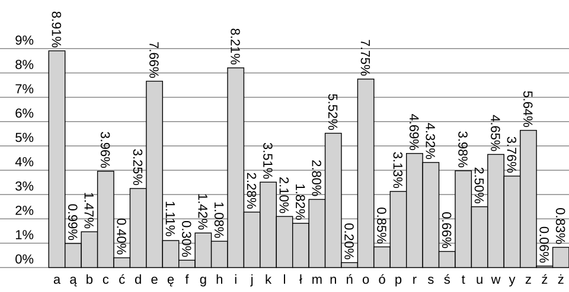

# Cultists Prophecy

```
Cryptography

Difficulty: Latwe (23 rozwiazania)
Author: Jakub Rawski

The Cult of Fours and the Cult of Sixes seek to secure the truth revealed by the Prophet Vincent Ildefons Genere. 
Using the prophet's methods, they encrypted the message and then jointly encoded the base.
The Cult of Fours designated the key, and the Cult of Sixes is responsible for its storage. 
Unfortunately, the Cult of Sixes lost the key in the holy war. 
Your task is to recover the truth hidden within the encrypted message.


```
Plik zawiera zakodowana wiadomosc: 

Zawartosc pliku:

```
SCBxcWFwIGtkbHB6aXVzIGF4anp2IHdvdGl4cyB0IGFkd2RrbW0gZGVtc2VtcCBvIG5xd3JqIHEgYSBrd3dhYXAgZSB3d2NreSBhIGgga2RzZHFpIHJseG1rbHZzIGx6IGtzIGJwYXggYSBudyB3YXAgYXhzeXFpCkEgZWlvIGt0bSB3bGx0cyBycCBlIGhmdGMgYSBjZXd2cXggYXBneWtpIG9rbXdyd3cgcnNvIGVzdmwgaSBhYWxidiBra21oZCBrIGhldXN3aG0ga21mamx0bSBrdG0gYWFwenJhIGxqYyBvIG5xd3JqIHEgYSBrdmN0YXB2bW0gbmhjbGxrIGRmbHNtIGNld3Z3IGRpIGEgZmxhIG0gb3pzc2QgeWl3CgpGbCB4c3VraXhjZiBqY2R6IGFwZ2h3IGUga3d3YWcgbWdwZyBoIHZlayB0IGFwZ2h3IG53ZGIgZCBmbHVtCkEgeHdhYXdxIFhnIHVtd2wgb3pzeWwgcSB4ZyB1bXdsIGt2ZWMga20gYSB1a2JpanBrbCBjY3dvc25wIGRzbmhjZmwgYW13IGNjZ3ogbCBlIHdycGFnYWYgc3NmbmhjIGt0bSBncmxhCgpBbHBsYyBrZWl2a2tnIHZycHNwCk8gbmh4d2NtZ3ogdW13bCBod3BzIGgga2RscHppdXMgcmlrZSBhYWFsYnBnIGgga2RscHppdXMgcmlrZSBhaWZkCkUgd3JwYWdhZiByaWtlIGtta2tpIGEga2ttd3V0YyBud2RiIHdhd2kgYSBra213dXRjIG53ZGIgb2pwYQoKTSBkZmwgc3Zhd2FhcGxkYWx0ClhzdiByaWtlIHEgeHN2IGFtdyBkYmVmdG0gZmcgZXcgZ2cgdW13bCBoIHZlayB1bXdsIGVtZCBvIGR0c290bSBlIGx6IGtzIG8gZHRzb3RtIG53ZGIgYSB1a2l3YXAKClZlIHJ0bXFhIHQgZSBhZ29obXcgaCB0aWt0bSBtIG8geHFpa25xaSBvIGRtdnVmIHEgYSBreXFpIGh6ZXhzY2hlZnogYXBnaGkKWGcgbncgbndkYiByYXAgcmlrZSBqaXIga3ZldWttcmFsIHEgeGcgbncgd2FwIGxkYXByaSB2a3FpYnAgYW13IGggdmVrCgpOaHh3Y2cgb3N4cWlmdG0gcHdraSBycyBoYWd6emxkYXAga2RscHpjIHJ5aW9hIGRpIHJzIHlxaXR0bSBncmVtdnEgZGttd2tzbSBvdHdocyBoIGFhYWxiCldycGFnIGprbW8gaHdncmFwIHh2cnBoIGhnd3FycSBkaGlrbiBvYWFsaGgga2hxaXV0IHZldiB5aXFhIGRoaWtuIG9wZ2R3YSB0Y2hxYSBoIGtta2tnCgpNIGV6ZW1kdApFIGdyZW12d25wIG53ZGIgdGduaGVscHMgZSBvIGRoaWtucXkgYnBheCBocHRyYWwKRSBncmVtdnducCBud2RiIGhqem9lIHMgaCBhZHdka21tIHVtd2wgb3dxCgpTIHdjaCBra21oZCB0IHVzb3R0IGEgdmN3aHJwClEgeGcgdW13bCBoIHZlayB0IGJzIGJwYXggciB5aXFhIHQgYnMga3RtIHdsbHZtdyBybGMgdWtpdyBrdG0gZGV0bXJhCgpZcWl1cyBlbXduIGppdmtxaSBsbHMKYSBrd3dhYXAgcSBhIHV0YWRxIGggYWlqbmMgbSBvIG5oZWt0bSBhIG96bGRhcCBxIGEgcnRtcWEgaCBhcGd5a3kgYSBoIGttd3lxeQpGdG1neiBuaHh3Y2cgZndvaSBkIGZsdW0gYSBkaGlrbiB2bXducCBmd29obXcgeWloIGZsdW0KcyBldyBnZyB1bXdsIHlxaXVzIGFtdyBkYmVmdG0gbSBseiBrcyBrdG0gd2xsdm13IHlxaXVzIGhza2VpcmFwCgpCZWMga2l0YWRpcmcgaCBoYWd1YyBhIGt3d2FhcCBxIGEgcnlpb20gaCBrbWtrZyBtIG8gZGVtd2V0aQpBIGVpbyBicGF4IGEgZWlvIGt0bSB3bGx2bXcgQVJFTFZ7cXJmMGhxM3Z1al91NG40X2o0bnIzX29tdzdnX2RxdTRfZV9mZDNvaG0zfQ==
```

Widzac ze plik konczy sie znakami == mozna smialo zalozyc ze jest to Base64.
(polaczenie  Bazy 6 i 4 tak jak kulty sie nazywaly)
Po odkodowaniu dostajemy: 

```
H qqap kdlpzius axjzv wotixs t adwdkmm demsemp o nqwrj q a kwwaap e wwcky a h kdsdqi rlxmklvs lz ks bpax a nw wap axsyqi
A eio ktm wllts rp e hftc a cewvqx apgyki okmwrww rso esvl i aalbv kkmhd k heuswhm kmfjltm ktm aapzra ljc o nqwrj q a kvctapvmm nhcllk dflsm cewvw di a fla m ozssd yiw

Fl xsukixcf jcdz apghw e kwwag mgpg h vek t apghw nwdb d flum
A xwaawq Xg umwl ozsyl q xg umwl kvec km a ukbijpkl ccwosnp dsnhcfl amw ccgz l e wrpagaf ssfnhc ktm grla

Alplc keivkkg vrpsp
O nhxwcmgz umwl hwps h kdlpzius rike aaalbpg h kdlpzius rike aifd
E wrpagaf rike kmkki a kkmwutc nwdb wawi a kkmwutc nwdb ojpa

M dfl svawaapldalt
Xsv rike q xsv amw dbeftm fg ew gg umwl h vek umwl emd o dtsotm e lz ks o dtsotm nwdb a ukiwap

Ve rtmqa t e agohmw h tiktm m o xqiknqi o dmvuf q a kyqi hzexschefz apghi
Xg nw nwdb rap rike jir kveukmral q xg nw wap ldapri vkqibp amw h vek

Nhxwcg osxqiftm pwki rs hagzzldap kdlpzc ryioa di rs yqittm gremvq dkmwksm otwhs h aaalb
Wrpag jkmo hwgrap xvrph hgwqrq dhikn oaalhh khqiut vev yiqa dhikn opgdwa tchqa h kmkkg

M ezemdt
E gremvwnp nwdb tgnhelps e o dhiknqy bpax hptral
E gremvwnp nwdb hjzoe s h adwdkmm umwl owq

S wch kkmhd t usott a vcwhrp
Q xg umwl h vek t bs bpax r yiqa t bs ktm wllvmw rlc ukiw ktm detmra

Yqius emwn jivkqi lls
a kwwaap q a utadq h aijnc m o nhektm a ozldap q a rtmqa h apgyky a h kmwyqy
Ftmgz nhxwcg fwoi d flum a dhikn vmwnp fwohmw yih flum
s ew gg umwl yqius amw dbeftm m lz ks ktm wllvmw yqius hskeirap

Bec kitadirg h haguc a kwwaap q a ryiom h kmkkg m o demweti
A eio bpax a eio ktm wllvmw ARELV{qrf0hq3vuj_u4n4_j4nr3_omw7g_dqu4_e_fd3ohm3}
```

Widzimy flage, niestety jest ona zaszyfrowana.
Szyfr byl stworzony przez niejakiego V.I.Genere co jest jasnym nawiazaniem do szyfru Vigenere.
Wiedzac ze pierwsze 5 znakow to PJATK sprobojmy odszyfrowac plaintextem:
```
ARELV{qrf0hq3vuj_u4n4_j4nr3_omw7g_dqu4_e_fd3ohm3}
(Klucz = PJATK)
LIESL{bif0og3glj_b4d4_u4er3_vch7x_dxk4_p_wd3vxx3}
```
Widzimy ze znak na miejscu 0 i 4 sie potwarzaja mimo ze sa rozne.
To znaczy ze `len(klucz = 4)` oraz k = `LIES`
ARELV{qrf0hq3vuj_u4n4_j4nr3_omw7g_dqu4_e_fd3ohm3}
(Klucz = LIES)
PJATK{inn0wi3rcy_m4j4_r4cj3_kul7y_zyj4_w_bl3dzi3}
```

ALTERNATYWNE ROZWIAZANIE: 
wiedzac ze jest to szyfr klasyczny mozemy zliczac znaki ktore wystepuja najczesciej i "bruteforcowac"
dla kolejnych len(klucz) dzielac na grupy w zaleznosci od wyniku `pozycja_znaku` mod `klucz`

W przypadku gdybysmy nie znali prefixu flagi, w taki sposob trzeba bylo by to zadanie rozwiazac

Flaga to : `PJATK{inn0wi3rcy_m4j4_r4cj3_kul7y_zyj4_w_bl3dzi3}` 