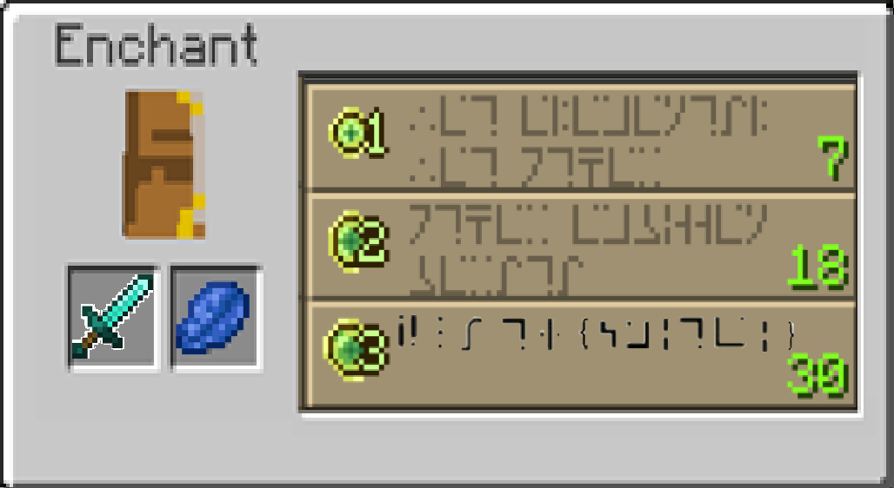
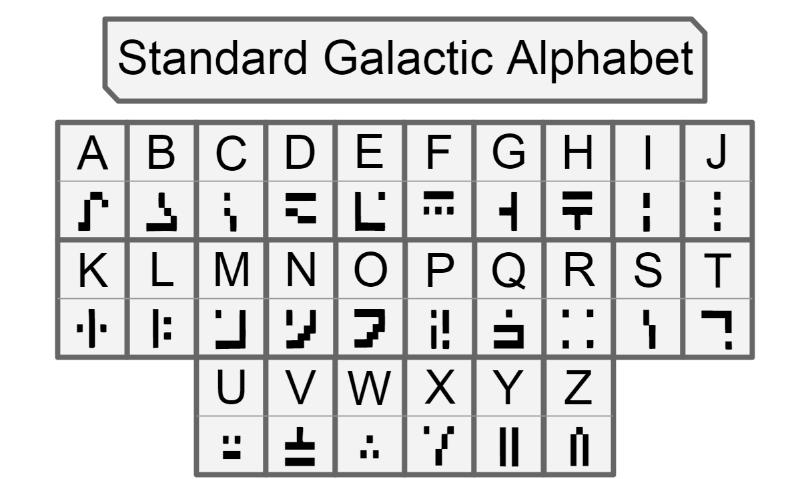

# Enchanting table

```
Cryptography

Difficulty: Trywialne (24 rozwiazania)
Author: Jakub Rawski

After defeating the Ender Dragon, Steve gained enough experience to enchant his Diamond Sword to its maximum level.
For some unexplained reason, the enchantment table gave him an enchantment he couldn't read
Decipher the Minecraft language so Steve knows what enchantment his weapon will have. (all uppercase)

```

Patrzac na zdjecie, widzimy ze 3 rzad posiada niezakodowane nawiasy
Wystarczy wyszukac jaki alphabet jest uzywany w grze Minecraft: 



Wystarczy teraz dopasowac znak do nasszego alfabetu


Wynik: `PJATK{SMITEI}` 