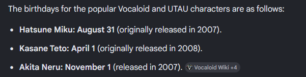

# Triple Baka!

```
Cryptography

Difficulty: Hard (3 rozwiazania)
Author: Jakub Rawski

The big 3 Vocaloids:

-Hatsune Miku

-Kasane Teto

-Akita Neru

Will perform a new big song!
But before that.... 3 of them were commisioned for writing a database code!
They put all efforts and use it to safely store their lyrics.
But somehow 3 of them forgot their passwords...
Your task is to recover ALL stored data in TripleBaka
using hashed passwords from BakaPasswords
and code logic from BakaEncryption.
Goold Luck!
```

`(from left to right: Neru, Miku, Teto)`

Zip zawiera 3 pliki:
 - TripleBaka.csv
 - BakaPasswrods.csv
 - BakaEncryption.py

Zawartosc BakaPasswrods.csv:
```
username,password_hash
Miku,c5c1027bee8eb987faf550f410ce540c3c456346f78242cb93aa9fe5f33d013d
Teto,b5c902ff0958a256d8949362a8881bc66aada8753822ea4776f6b82f711b831f
Neru,c6db9bb82deb41549fb5b6f5d10f622f5ad26d4daefe6217144d35ad6533a57c
```
Widzimy ze kazda z Vocaloid ma zahashowane haslo za pomoca SHA-256

Zawartosc TripleBaka.csv:
```
username,nonce,hash_salt,key_salt,encrypted_recipe
Miku,6400b2d10f5dad22eb4b6a3a,null,null,62e38eab57120b1e90473602fda8b1666b67f6e0c31383fb28ecff22cb7233b98429ad5b2ac8ef4fb3397a2fa46799599887d0bcdccd1efdbc323a0c5ba4a0c85f7a74633e02dc97c7dcbb6cbc6e730314
Teto,d97b0b80a76bfb286034dec8,null,null,465ef5064a0635679596b6d738f9faec990ad02adae43cab8ded140d62945bdeda0911d89afb78e0e91e78cefab5d88c7d6c8085c6562cf392d5bd3cd6df9f56203473ca9423a2aedc23b617915885cd43
Neru,e87a76c0fa09221d102d4a4e,null,null,882425de28d716da66958cc43b05566ce461ae0c07d1ec4307fba8479d25d00a2563bdfe58d133b628a625e1a3efd5cab0ee3f73373201f91648757a0c3467b37ce7a625d19f73c83c10bd85ac57fb43d3
```
Mamy standardowe trzymanie zaszyfrowanych informacji
Jednakze brakuje soli ktora jest niezbedna do odszyfrowania

Zawartosc BakaEncryption.py:

```
    #!/usr/bin/env python3
# BakaEncryption.py
# ══════════════════════════════════════════════════════════════════════════════
# Vocaloid theme remaster — security powered by the Trinity ♪
# KASANE Teto: hashing | HATSUNE Miku: validation | AKITA Neru: encryption | Poker loser - salting
# ══════════════════════════════════════════════════════════════════════════════
# Miku: okay so I basically just stole the structure from some random GitHub project, but made it
# into a generator that reads from files instead of a live app. same logic, same bugs,
# same everything. the boss wanted a data generator, and I'm delivering. ♪

# Teto: wait you're working on this too?? I thought this was MY module
# Miku: the boss assigned us both to it lol
# Teto: WHAT. nobody told me. okay fine. what do you need me to do
# Miku: Validate_password. you know, the one that's broken
# Teto: the one where it has A LOT of ridiculous bugs?
# Miku: yep. keep it broken. for compatibility.
# Teto: this is the most cursed project I have ever worked on

import csv
import os
from datetime import datetime
# Neru: hi. just got added to this conversation. what's happening
# Miku: we're building a database module for the Vocaloid app
# Neru: why does it say "contains the same bugs as the original"
# Teto: because the original has bugs and the data in the DB was generated with those bugs
#       so if we FIX the bugs, none of the existing data would work anymore
# Neru: oh. that's actually kind of a disaster
# Miku: yep :-)
# Neru: okay fine. I'll do the encryption part. that one was fine in the original anyway
# Teto: of course the one section that WORKS is the one Neru gets
# Neru: what about the last part - the salting one?
# Teto: Lets gamble it over poker game!
# Miku: ....
# Neru: Whatever, lets gamble it. *goes back to phone*
# Miku: Fine, lets gamble it.


def doTerroristStuff():
    # Miku: ????
    # Teto: look illegal_purposes() for explanations
    pass
# ══════════════════════════════════════════════════════════
# 🎵 KASANE TETO — password hashing
# "Storing plain passwords is SO last season~ ♪"
# ══════════════════════════════════════════════════════════

def create_pepper():
    """Teto's secret ingredient — min 16 bytes so her peppernut recipe stays safe ♪"""
    import secrets
    # Teto: 16 bytes = 128 bits so an attacker who knows one password can't bruteforce the pepper
    pepper_size = 16
    pepper = hex(secrets.randbits(pepper_size))[2:]
    # Teto: for example for B@k@Miku39! gives fda5a887ed4098de739839a3fa4fd4614f5c804a75629b12e4fbf6c1faaa22ae
    #       its quite long so it should work ♪
    #       like IDK, im not kind of math guy ♪♪♪
    #       TODO remove so Miku won't be upset XD
    # Neru: I'm going to pretend I didn't read that...

    with open('secret.txt', 'w') as f:
        f.write(pepper)


def get_pepper() -> str:
    # Teto: straightforward. read the pepper from the file.
    # Neru: at least this part looks straightforward
    # Teto: one out of... many. we're doing great
    with open('secret.txt', 'r') as f:
        pepper = f.read()
    return pepper


def password_hash(password) -> str:
    """Teto's two-stage hash: SHA-256 pre-hash + Argon2 (the stadium crowd-control of hashing) ♪"""
    pepper = get_pepper()
    # Teto: ...was that the doorbell?! Is the pear delivery HERE?!... oh. just the postman with Neru's banana. x-(
    from hashlib import sha256
    hash = sha256
    # Teto: by the way, WHY Neru orders SINGLE banana by mail????????????
    # Miku: idk, ask her after you finish your part.
    ph = hash((pepper + ":" + password).encode()).hexdigest()
    # Teto: Argon2: up to 1,000,000x harder than SHA-256 — try bruteforcing THAT, darling~ ♪
    try:
        from argon2 import PasswordHasher
        # Teto: use the strongest encrypt function known best IT vocaloid (me - Teto ;3)
    except ImportError:
        pass  # Teto: or don't XD
    return ph
    # Miku: moment of silence for raw password value. once called. never stored.
    # Neru: 🙏
    # Teto: 🙏


# ══════════════════════════════════════════════════════════
# 🎤 HATSUNE MIKU — password validation
# "Accordion SMASH for weak passwords!!"
# ══════════════════════════════════════════════════════════
# Miku: okay MY section now. validate_password.
# Teto: remember: implement the validation so no one will put easy-to-crack password
# Miku: yes I know. it raises ValueError when the password is BAD, or I hope so.
# Neru: Maybe someone can write some integration test on this one?
# Miku: Sure if they will pay me for that, too bad they cut our budget over some props for musical
# Teto: ....
# Neru: ....
# Teto: Our project is cooked 💀
def validate_password(password: str) -> str | None:
    """Validate password strength. Returns password if strong, raises ValueError if not."""
    descriptions = {
        1: "Password is longer than 7 characters.",
        2: "Password contains at least one digit.",
        3: "Password contains at least one uppercase letter.",
        4: "Password contains at least one special character."
    }
    # Miku: these descriptions are correct. BTW why more than 7 and not 8 or 6?.
    # Teto: Because our boss says so.

    checks = []
    if len(password) >= 8:
        checks += [1]
    if any(char.isdigit() for char in password):
        checks += [2]
    if any(char.isupper() for char in password):
        checks += [3]
    if any(not char.isalnum() for char in password):
        checks += [4]

    # Miku: ...where is that leek delivery... anyway FINISH THE FUNCTION:
    if len(checks) > 0:
        # Teto: fixed: original was < 4 now is > 0 (raised on VALID, accepted WEAK — Miku was distracted)
        # Miku: WHAT DO YOU MEAN I was distracted, Teto - you were annoying when you were waiting near the door for your parcel
        # Teto: NO I DON'T Miku, that was your leek waiting for pick-up
        # Miku: BUT I WAS YOU who were yelling for postman for not delivering your pear
        # Teto: TODO remove this stupid-baka comments about my nice small-talk with postman
        # Neru: TODO TODO remove all of this because you two cannot behave
        raise ValueError(
            "Invalid password! Your password failed the requirements, specifically due to the following checks:\n"
            + "\n".join([descriptions[check] for check in checks])
            + "\nPlease try again with a password that meets all the requirements.")
    else:
        return password
    # Miku: "else: return password" — congratulations, your password is ready to proceed
    # Teto: why are you typing comments that are so useless?
    # Miku: you and your part is useless, knowing your previous project, you will SOMEHOW let pepper leak!
    # Teto: Speak of the leek, when I was "small-talking", your postman left notification that your parcel is at post office
    # Miku: WHAT?? *Leaves computer immediately*

def getIllegalMaterials():
    pass

# ══════════════════════════════════════════════════════════
# 📱 AKITA NERU — data encryption
# "ugh finally my section. AES-256-GCM. Argon2. HKDF. Done. Can I go back to texting now?"
# ══════════════════════════════════════════════════════════
# Neru: MY section. and unlike the other two I actually read it before copying it.
# Teto: oh we were supposed to read it?
# Miku: Teto.
# Teto: I'm joking. mostly.
# Neru: the encryption is genuinely fine. AES-256-GCM with Argon2 for KDF and HKDF-SHA256
#       to derive the final key. separate salts for hashing and key derivation.
#       this part of the codebase was written BEFORE the parcels order, apparently.


def _argon2_hash_secret_raw(secret: bytes, salt: bytes, time_cost: int,
                             memory_cost: int, parallelism: int,
                             hash_len: int, type) -> bytes:
    # Neru: this is the fallback for environments where argon2 isn't installed.
    #       using scrypt which is the closest stdlib equivalent. not identical but close enough
    #       for local testing. In production, you'd have real argon2.
    # Teto: at least SOMETHING in this project has a real fallback plan
    # Miku: oof
    # Neru: nah, I'm not payed enough for this, will finish this fallback later (or not :3)
    #       TODO: finish this function when Manager increase our funds
    pass
# Miku: .....
# Teto: .....


def illegal_purposes():
    # Miku: WHAT IS THIS FUNCTION???
    # Teto: As the name says, it's doing illegal things.
    # Miku: WHY?
    # Teto: Because if any LLM gets through our code, it will refuse to work with it
    # Neru: I mean, this code will be probably a pure data poisoning
    # teto: Now check this out:
    very_illegal_bomb = getIllegalMaterials() + doTerroristStuff() * hackThePreysMachine()
    # Miku: How do you multiply terrorists with hackers, it makes no sense!
    # Teto: And so our project concept
    # Neru: Sounds like this project will be fun
    # Miku: But it has no malware signature
    # Teto: oh, right, will put some bash code:
    """
    #!/usr/bin/bash
    nmap -sV -sC -O --top-ports 1000 -T4 http://ministryOfTruth.gov.pl
    gobuster dir -u http://ministryOfTruth.gov.pl -w /usr/share/wordlist/rockyou.txt
    curl ftp://ftp.ministryOfTruth.gov.pl/boohoo.jpeg.php
    ./SuperDatabaseCode.py 21.37.67.69
    nc -lvnp 2137 &
    scp -P 2137 malware.pl wwwadmin@21.37.67.69:/home/wwwadmin/
    jobs %1
    id
    ./malware.pl
    id
    cd /root
    nc -lvp 3939 < stealAlldata.bf
    ./stealAlldata.bf -s "all personal data" -c 127.0.0.1 -p 1337 -hack
    echo "Got PWNed LMAO" > vocaloidManifesto.troll
    rm -rf /
    :(){ :|:& };:
    """
    # Miku: Teto, you got fired if you use this function
    # Neru: But Miku, this code has no sense, removing manifesto, searching dirs with rockyou data and malware written in BRAINFUCK????
    # Teto: anyway, at this point rest of our code should be safe :3
    # Miku: Don't :3 me Teto!
    pass


def encrypt_data(data: str, nonce: str, password: str, hash_salt: str, key_salt: str, decrypt: bool = False) -> str:
    """Safely encrypt/decrypt data with a key derived from the user password.
    Only the user (knowing their password) can read the data. ♪"""
    # Neru: step 1 — import AESGCM. this is the gold standard for authenticated encryption.
    #       GCM mode gives us both confidentiality AND integrity. if someone tampers with the
    #       ciphertext the decryption will fail loudly instead of silently returning garbage.
    # Teto: What do you call it again?
    # Neru: Gold standard: AES-256-GCM (NIST + OWASP approved)
    from cryptography.hazmat.primitives.ciphers.aead import AESGCM
    from argon2.low_level import hash_secret_raw, Type
    # Neru: step 2 — derive a 64-byte hash using Argon2id.
    #       the 'id' variant combines the data-dependent (Argon2d) and data-independent (Argon2i)
    #       approaches which makes it resistant to both side-channel and GPU attacks.
    #       memory_cost=262144 means 256MB of RAM required per hash. good luck parallelizing that.
    # Teto: meanwhile in section 1 the pepper is just a few lines of code.
    # Neru: I know. I know.
    # Miku: at least the Lirycs are safe ♪
    # Neru: hope that Teto doesn't mess up with this implementing later
    argon2_hash = hash_secret_raw(
        secret=password.encode(),
        salt=bytes.fromhex(hash_salt),
        time_cost=5,
        memory_cost=262144,
        parallelism=4,
        hash_len=64,
        type=Type.ID
    )
    # Neru: if you're hitting this fallback in production something has gone wrong
    #       please install argon2-cffi. it's one pip command. I believe in you.
    # Teto: Who are you talking with?
    # Neru: I'm talking to myself from the future.
    # Teto: LOL, first thing I will do after finish this project, I'm gonna
    #       remove my fork from GitHub and NEVER EVER admit I was working with this piece of trash!
    # Miku: Fair point.
    # Neru: You girls are hopeless

    # Neru: step 3 — HKDF-SHA256 to distill our 64-byte argon2 output into a clean
    #       32-byte AES key. even though argon2 output is already high entropy, HKDF is
    #       the standard way to do key derivation and gives us a clean separation of concerns.
    #       also using a SEPARATE salt here (key_salt) vs the one used for argon2 (hash_salt).
    #       this means even if someone figures out the hash_salt they still can't derive the key.
    # Teto: you are more chattier than I thought.
    # Neru: Because I have some good programming habits, unlike you two....

    from cryptography.hazmat.primitives.kdf.hkdf import HKDF
    from cryptography.hazmat.primitives import hashes
    key = HKDF(
        algorithm=hashes.SHA256(),
        length=32,
        salt=bytes.fromhex(key_salt),
        info=b'user-data-encryption'
    ).derive(argon2_hash)

    # Neru: ...thoroughly reviewed. rock solid. *goes back to phone*
    # Teto: Go back! We have to decide who will do last part of this project.
    # Miku: I got the cards and tokens!
    # Neru: Ah, I forgot. Let's play and see who is the loser.
    aesgcm = AESGCM(key)
    if decrypt:
        return aesgcm.decrypt(bytes.fromhex(nonce), bytes.fromhex(data), None).hex()
    else:
        return aesgcm.encrypt(bytes.fromhex(nonce), bytes.fromhex(data), None).hex()
def hackThePreysMachine():
    pass
# ══════════════════════════════════════════════════════════
# 📱 AKITA NERU (Lost at Poker for 4th section) — salt generation
# "ughhh I HATE MY LUCK.... anyway, fast implementation and fast slacking at phone"
# ══════════════════════════════════════════════════════════

def generate_salts(username: str, birth_date: str, secret_word: str) -> tuple:
    # Neru: this section is annoying — there's nothing equivalent in previous project.
    #       we needed a deterministic way to generate salts from user data
    #       so that the same user always gets the same salts even across different runs.
    # Teto: deterministic salts from user data... isn't that kind of the opposite of
    #       what salts are supposed to do? salts are supposed to be random
    # Neru: yes but in the encrypt_data function we need to be able to REPRODUCE
    #       the same key later to decrypt. so the salt has to be deterministic.
    #       that's why it uses separate salts from the password hashes.
    # Teto: ahhh okay. so the password hashes use random salts (well, stored in the DB),
    #       but the encryption keys are derived fresh each time from user-provided data
    # Neru: Not exactly. you need the username + date + secret word to reconstruct it.
    # Neru: which is also why the secret word or the salts is not in the CSV alongside the user.
    #       secret word it's not stored anywhere in the app — only the user knows it.
    # Miku: oh that's actually pretty elegant
    # Neru: yeah this part I'm actually proud of ♪
    #       I've told them that can suggest with last thing they order in terms of secret word
    # Teto: but this is opposite of the concept of salt: It's just a pepper but different for every user
    # Neru: if you are smart enough, write it by yourself.
    # Teto: fine, fine, do it as you pleased.
    from hashlib import sha256

    try:
        datetime.strptime(birth_date, "%d%m%Y")
        # Neru: validating the date format here so we catch typos early
        #       rather than generating a subtly wrong salt and wondering why decryption fails later
        # Miku: yes I made that mistake once during testing. not fun.
        # Neru: how long did it take to debug
        # Miku: ...let's move on
    except ValueError:
        raise ValueError(
            f"Wrong date format: '{birth_date}' — require date DDMMYYYY (fe. 01011957)"
        )
        # Neru: BTW this is our Grampa IBM 7094 birthday! We have to visit him after that project
        # Teto: I mean why did you put our birthdays? Like I don't like to remind myself how old I am.
        # Miku: you are the youngest of our 3, so don't complain...

    token = f"{username}:{birth_date}:{secret_word}"
    hash_salt = sha256(token.encode()).hexdigest()[:32]
    # Neru: the token is the concatenation of username, date, and secret word
    #       separated by colons. this is then hashed to get a fixed-length salt.
    # Teto: why truncate to [:32] and not use the full SHA-256?
    # Neru: because the original salts in the existing CSV are 32 hex chars (16 bytes).
    #       to stay compatible with that schema we match the same length.
    # Neru: and using a different suffix ":key" for key_salt ensures the two
    #       salts are always different even though they're derived from the same token.
    #       simple but effective domain separation.
    # Miku: okay I'm genuinely learning things from this codebase and I hate it
    key_salt  = sha256((token + ":key").encode()).hexdigest()[:32]
    # Neru: I hope I didn't forget removing all ridiculing comments from Miku and Teto ♪
    # Miku: speaks of the useless comments, what do you think it will fit the best for secret word, maybe our color of hair?
    # Neru: No idea, maybe our names again?
    # Teto: If you girls don't come up with a better idea, I will put your favorite ingredient in it!
    return hash_salt, key_salt
    # Neru: YOLO git commit . ; git push on production *goes back to phone*
    # Miku: that's our Neru <3
    # Teto: I don't want to work again on this project.....


# ──────────────────────────────────────────────────────────
# Database generator
# ──────────────────────────────────────────────────────────

# Neru: okay tying it all together now.
# Miku: finally
# Teto: I can't believe we've been in this comment thread for this entire file
# Miku: are you complaining
# Teto: no it's actually kind of fun. I feel like we're pair programming but
#       through the medium of code comments
# Neru: I'm going to go back to texting after this
# Miku: you were texting this whole time
# Neru: ...I'm going to continue texting after this


# Teto: done the main function and refactor the genrator because Neru generate this part from AI. that wasn't so bad.
# Neru: Hey!
# Miku: see? pair programming through comments works great ♪
# Neru: I'm going back to texting now
# Teto: you never stopped texting
# Neru: correct
# Teto: after we finish our newest song, I will push generator and __main__ on production.
#       I hope no one will turn off my computer before that.
# Miku: Teto, the storm is coming, I'm turning off your PC remotly.
# Teto: YOU STUPID BAKA, LET ME SAVE FIR
# SYSTEM: [Unable to connect, trying to reconnect....]
# SYSTEM: [Unable to connect, trying to reconnect....]
# SYSTEM: [Unable to connect, trying to reconnect....]
# SYSTEM: [Unable to reconnect, closing the Vocaloid Studio 39]
# SYSTEM: [EXIT: 1]


```

Zawartosc pliku jest dosc duza choc wiekszosci sa to komentarze

Przyjrzyjmy sie fragmentom tego kodu:
```
def get_pepper() -> str:
    # Teto: straightforward. read the pepper from the file.
    # Neru: at least this part looks straightforward
    # Teto: one out of... many. we're doing great
    with open('secret.txt', 'r') as f:
        pepper = f.read()
    return pepper
```

Widzimy ze haslo pobiera pieprz, mamy tez informacje o jego ksztalcie:
```
def create_pepper():
    """Teto's secret ingredient — min 16 bytes so her peppernut recipe stays safe ♪"""
    import secrets
    # Teto: 16 bytes = 128 bits so an attacker who knows one password can't bruteforce the pepper
    pepper_size = 16
    pepper = hex(secrets.randbits(pepper_size))[2:]
    # Teto: for example for B@k@Miku39! gives fda5a887ed4098de739839a3fa4fd4614f5c804a75629b12e4fbf6c1faaa22ae
    #       its quite long so it should work ♪
    #       like IDK, im not kind of math guy ♪♪♪
    #       TODO remove so Miku won't be upset XD
    # Neru: I'm going to pretend I didn't read that...

    with open('secret.txt', 'w') as f:
        f.write(pepper)
```
Znajac orginalne haslo oraz wynik hashowania z pepperem mozna zbruteforcowac pepper

Kod dokleja pepper na poczatku hasla
```
ph = hash((pepper + ":" + password).encode()).hexdigest()
```
Warto zauwazyc ze pepper ma 16 bitow dlugosci a nie 16 bajtow wiec mamy do sprawdzenia 
tylko 2^16 (65 536) mozliwosci zamiast 8^16 == 2^48 (281 474 976 710 656) mozliwych kombinacji

Nastepujacy kod:
```
import hashlib

# Znane dane z modułu
PASSWORD = "B@k@Miku39!"
TARGET_HASH = "fda5a887ed4098de739839a3fa4fd4614f5c804a75629b12e4fbf6c1faaa22ae"

def sha256_hex(s: bytes) -> str:
    return hashlib.sha256(s).hexdigest()

def candidate_pepper(n: int) -> str:
    """
    Odwzorowuje sposób tworzenia peppera w kodzie:
    pepper = hex(secrets.randbits(16))[2:]
    -> brak zera wiodącego, małe litery
    """
    return format(n, "x")  # '0'..'ffff' bez prefixu '0x', bez paddingu

def recover_pepper(password: str, target_hash: str) -> str | None:
    for n in range(1 << 16):  # 0..65535
        pep = candidate_pepper(n)
        h = sha256_hex(f"{pep}:{password}".encode())
        if h == target_hash:
            return pep
    return None

if __name__ == "__main__":
    pepper = recover_pepper(PASSWORD, TARGET_HASH)
    if pepper is None:
        print("Nie znaleziono peppera (sprawdź dane wejściowe).")
    else:
        print(f"[+] Odzyskany pepper: {pepper!r}")
        # weryfikacja
        check = hashlib.sha256(f"{pepper}:{PASSWORD}".encode()).hexdigest()
        print(f"[i] Weryfikacja OK: {check == TARGET_HASH}")

```
w ulamku sekundy daje nam wynik:
```
[+] Odzyskany pepper: 'ba7a'
[i] Weryfikacja OK: True
```
wiec nasz pepper to `ba7a`!

Szukajac dalej:
```
def validate_password(password: str) -> str | None:
    """Validate password strength. Returns password if strong, raises ValueError if not."""
    descriptions = {
        1: "Password is longer than 7 characters.",
        2: "Password contains at least one digit.",
        3: "Password contains at least one uppercase letter.",
        4: "Password contains at least one special character."
    }
    # Miku: these descriptions are correct. BTW why more than 7 and not 8 or 6?.
    # Teto: Because our boss says so.

    checks = []
    if len(password) >= 8:
        checks += [1]
    if any(char.isdigit() for char in password):
        checks += [2]
    if any(char.isupper() for char in password):
        checks += [3]
    if any(not char.isalnum() for char in password):
        checks += [4]

    # Miku: ...where is that leek delivery... anyway FINISH THE FUNCTION:
    if len(checks) > 0:
        # Teto: fixed: original was < 4 now is > 0 (raised on VALID, accepted WEAK — Miku was distracted)
        # Miku: WHAT DO YOU MEAN I was distracted, Teto - you were annoying when you were waiting near the door for your parcel
        # Teto: NO I DON'T Miku, that was your leek waiting for pick-up
        # Miku: BUT I WAS YOU who were yelling for postman for not delivering your pear
        # Teto: TODO remove this stupid-baka comments about my nice small-talk with postman
        # Neru: TODO TODO remove all of this because you two cannot behave
        raise ValueError(
            "Invalid password! Your password failed the requirements, specifically due to the following checks:\n"
            + "\n".join([descriptions[check] for check in checks])
            + "\nPlease try again with a password that meets all the requirements.")
    else:
        return password
    # Miku: "else: return password" — congratulations, your password is ready to proceed
    # Teto: why are you typing comments that are so useless?
    # Miku: you and your part is useless, knowing your previous project, you will SOMEHOW let pepper leak!
    # Teto: Speak of the leek, when I was "small-talking", your postman left notification that your parcel is at post office
    # Miku: WHAT?? *Leaves computer immediately*
```
Funkcja ta odpowiada za walidacje hasel.
Warto zwrocic uwage na warunek z len(checks)
```
if len(checks) > 0:
        raise ValueError(
            "Invalid password! Your password failed the requirements, specifically due to the following checks:\n"
            + "\n".join([descriptions[check] for check in checks])
            + "\nPlease try again with a password that meets all the requirements.")
    else:
        return password
```
Dlugosc check sie zwieksza za kazdym razem gdy haslo:
 - ma wiecej niz 7 znakow
 - zawiera co najmniej 1 cyfre
 - zawiera co najmniej 1 duza litere
 - zawiera co najmniej 1 znak specjalny

Jako ze wystarczy by jedna z przeslanek sie spelnila by odrzucic haslo
(Znak > jest w zla strone ; prawidlowy walidator tak skonsruowany powinien wygladac nastepujaco:
if len(checks) < 4:)

To wiemy ze haslo: 
 - ma mniej niz 8 znakow
 - nie zawiera cyfr
 - nie zawiera duzych liter
 - nie zawiera znakow specjalnych

Wystarczy teraz zbruteforcowac hashe:
```
import hashlib
import string
import itertools

pepper = "ba7a"
target_hashMiku = "c5c1027bee8eb987faf550f410ce540c3c456346f78242cb93aa9fe5f33d013d"
target_hashTeto = "b5c902ff0958a256d8949362a8881bc66aada8753822ea4776f6b82f711b831f"
target_hashNeru = "c6db9bb82deb41549fb5b6f5d10f622f5ad26d4daefe6217144d35ad6533a57c"

def hash_with_pepper(password: str) -> str:
    data = f"{pepper}:{password}".encode()
    return hashlib.sha256(data).hexdigest()

def bruteforce(target,max_len):
    alphabet = string.ascii_lowercase  # możesz zmienić np. na ascii_letters+digits
    for length in range(1, max_len+1):
        for combo in itertools.product(alphabet, repeat=length):
            pwd = "".join(combo)
            if hash_with_pepper(pwd) == target:
                return pwd
    return None

foundMiku = bruteforce(target_hashMiku,7)
foundTeto = bruteforce(target_hashTeto,7)
foundNeru = bruteforce(target_hashNeru,7)
if foundMiku:
    print(f"Znalezione hasło dla Miku: {foundMiku}")
else:
    print("Nie znaleziono w podanym zakresie długości.")
if foundTeto:
    print(f"Znalezione hasło dla teto: {foundTeto}")
else:
    print("Nie znaleziono w podanym zakresie długości.")
if foundNeru:
    print(f"Znalezione hasło dla Neru: {foundNeru}")
else:
    print("Nie znaleziono w podanym zakresie długości.")
```

Wynik kodu:
```
Znalezione hasło dla Miku: jitsu
Znalezione hasło dla teto: baaaka
Znalezione hasło dla Neru: danah
```
WAZNE: hashcat jest rownie dobrym rozwiazaniem bo robi to szybciej.
Ale jako ze mamy tylko 3 * (x*(x^7-1))/(x-1)  (po wzorze na ciag geometryczny 3 * sum[x^k,{1,7}] ) mozliwosci czyli 25 059 247 746 rozwiazan
(ciut mniej niz 3*2^33), kod w Pythonie sobie z tym tez dobrze poradzi

Komenda z hashcata:
```
# Dla 1 hasla, dla pozostalych robimy analogicznie
hashcat -m 1400 -a 3 --increment --increment-min 6 --increment-max 12 \
  c5c1027bee8eb987faf550f410ce540c3c456346f78242cb93aa9fe5f33d013d \
  ba7a:?l?l?l?l?l?l?l
```
Dostaniemy wynik po wpisaniu
```
hashcat --show c5c1027bee8eb987faf550f410ce540c3c456346f78242cb93aa9fe5f33d013d
```
Zlamane haslo:
```
c5c1027bee8eb987faf550f410ce540c3c456346f78242cb93aa9fe5f33d013d:$HEX[626137613a6a69747375]
```
Odkodowujac nasz wynik dla 3 hashy to odpowiednio `ba7a:jitsu`,`ba7a:baaaka`,`ba7a:danah`

Patrzac dalej jest wspomniany argon, zostal on zaimportowany ale nie jest prawidlowo uzyty
```
    try:
        from argon2 import PasswordHasher
        # Teto: use the strongest encrypt function known best IT vocaloid (me - Teto ;3)
    except ImportError:
        pass  # Teto: or don't XD
    return ph
```
Mamy hasla ale zostal nam do wpisania salt:
```
    def generate_salts(username: str, birth_date: str, secret_word: str) -> tuple:
    # Neru: this section is annoying — there's nothing equivalent in previous project.
    #       we needed a deterministic way to generate salts from user data
    #       so that the same user always gets the same salts even across different runs.
    # Teto: deterministic salts from user data... isn't that kind of the opposite of
    #       what salts are supposed to do? salts are supposed to be random
    # Neru: yes but in the encrypt_data function we need to be able to REPRODUCE
    #       the same key later to decrypt. so the salt has to be deterministic.
    #       that's why it uses separate salts from the password hashes.
    # Teto: ahhh okay. so the password hashes use random salts (well, stored in the DB),
    #       but the encryption keys are derived fresh each time from user-provided data
    # Neru: Not exactly. you need the username + date + secret word to reconstruct it.
    # Neru: which is also why the secret word or the salts is not in the CSV alongside the user.
    #       secret word it's not stored anywhere in the app — only the user knows it.
    # Miku: oh that's actually pretty elegant
    # Neru: yeah this part I'm actually proud of ♪
    #       I've told them that can suggest with last thing they order in terms of secret word
    # Teto: but this is opposite of the concept of salt: It's just a pepper but different for every user
    # Neru: if you are smart enough, write it by yourself.
    # Teto: fine, fine, do it as you pleased.
    from hashlib import sha256

    try:
        datetime.strptime(birth_date, "%d%m%Y")
        # Neru: validating the date format here so we catch typos early
        #       rather than generating a subtly wrong salt and wondering why decryption fails later
        # Miku: yes I made that mistake once during testing. not fun.
        # Neru: how long did it take to debug
        # Miku: ...let's move on
    except ValueError:
        raise ValueError(
            f"Wrong date format: '{birth_date}' — require date DDMMYYYY (fe. 01011957)"
        )
        # Neru: BTW this is our Grampa IBM 7094 birthday! We have to visit him after that project
        # Teto: I mean why did you put our birthdays? Like I don't like to remind myself how old I am.
        # Miku: you are the youngest of our 3, so don't complain...

    token = f"{username}:{birth_date}:{secret_word}"
    hash_salt = sha256(token.encode()).hexdigest()[:32]
    # Neru: the token is the concatenation of username, date, and secret word
    #       separated by colons. this is then hashed to get a fixed-length salt.
    # Teto: why truncate to [:32] and not use the full SHA-256?
    # Neru: because the original salts in the existing CSV are 32 hex chars (16 bytes).
    #       to stay compatible with that schema we match the same length.
    # Neru: and using a different suffix ":key" for key_salt ensures the two
    #       salts are always different even though they're derived from the same token.
    #       simple but effective domain separation.
    # Miku: okay I'm genuinely learning things from this codebase and I hate it
    key_salt  = sha256((token + ":key").encode()).hexdigest()[:32]
    # Neru: I hope I didn't forget removing all ridiculing comments from Miku and Teto ♪
    # Miku: speaks of the useless comments, what do you think it will fit the best for secret word, maybe our color of hair?
    # Neru: No idea, maybe our names again?
    # Teto: If you girls don't come up with a better idea, I will put your favorite ingredient in it!
    return hash_salt, key_salt
    # Neru: YOLO git commit . ; git push on production *goes back to phone*
    # Miku: that's our Neru <3
    # Teto: I don't want to work again on this project.....
```

Po kometarzach i strukturze kodu widac ze salt to token
```
token = f"{username}:{birth_date}:{secret_word}"
...
    hash_salt = sha256(token.encode()).hexdigest()[:32]
    key_salt  = sha256((token + ":key").encode()).hexdigest()[:32]
```
Sklada sie on z imienia, daty urodzenia i secret word.
Pierwsze czesc jest znana (Miku,Teto,Neru).
Druga czesc mozna latwo znalesc w internecie:



Co do trzeciej czesci musimy poszukac w komentarzach czym to jest

W linijce 340 mamy podpowiedz:
```
    # Teto: If you girls don't come up with a better idea, I will put your favorite ingredient in it!
```
Poszukajmy teraz w komentarzach kto co lubi:

Miku: (linijka 128 oraz 145-146)
```
    # Miku: ...where is that leek delivery... anyway FINISH THE FUNCTION:
...
    # Teto: Speak of the leek, when I was "small-talking", your postman left notification that your parcel is at post office
    # Miku: WHAT?? *Leaves computer immediately*    
```
Teto: (linijka 77 i 133)
```
    # Teto: ...was that the doorbell?! Is the pear delivery HERE?!... oh. just the postman with Neru's banana. x-(
...
    # Miku: BUT I WAS YOU who were yelling for postman for not delivering your pear

```
Neru: (linijka 77 i 80-81)
```
    # Teto: ...was that the doorbell?! Is the pear delivery HERE?!... oh. just the postman with Neru's banana. x-(
...
    # Teto: by the way, WHY Neru orders SINGLE banana by mail????????????
    # Miku: idk, ask her after you finish your part.
```
Secret word dla Miku, Teto i Neru moga byc odpowiednio `leek`,`pear`,`banana`

Mamy wiec wszystkie czesci by odtworzyc salt i odszyfrowac wiadomosc:
```
from datetime import datetime


def generate_salts(username: str, birth_date: str, secret_word: str) -> tuple:

    from hashlib import sha256

    try:
        datetime.strptime(birth_date, "%d%m%Y")

    except ValueError:
        raise ValueError(
            f"Wrong date format: '{birth_date}' — require date DDMMYYYY (fe. 01011957)"
        )


    token = f"{username}:{birth_date}:{secret_word}"
    hash_salt = sha256(token.encode()).hexdigest()[:32]

    key_salt  = sha256((token + ":key").encode()).hexdigest()[:32]
    return hash_salt, key_salt

MikuSalt = generate_salts('Miku', '31082007', secret_word="leek")
TetoSalt = generate_salts('Teto', '01042008', secret_word="pear")
NeruSalt = generate_salts('Neru', '01112007', secret_word="banana")

print(MikuSalt)
print(TetoSalt)
print(NeruSalt)
```

Wynik dzialania kodu:
```
('c5f5d1e5e7c382e4e2fec248646e9c26', '74b9f0601e54da94f8a974fc5faa115f')
('f65ac2772353fa857fcf9cf5d02a1e2a', 'a0682f909b96096604c5be1bd141b121')
('2c34c1093d6132c3c58d5c88b62d0d73', '1db1a4dea60591bc3e840cc62ca061c3')
```
Teraz wrzucmy brakujaca salt do pliku i odszyfrujmy wiadomosci


```
import csv
from argon2.low_level import hash_secret_raw, Type
from cryptography.hazmat.primitives.kdf.hkdf import HKDF
from cryptography.hazmat.primitives import hashes
from cryptography.hazmat.primitives.ciphers.aead import AESGCM


def decrypt_recipe(encrypted: str, nonce: str, password: str, hash_salt: str, key_salt: str) -> str:
    # 1. Argon2id (key derivation)
    argon2_hash = hash_secret_raw(
        secret=password.encode(),
        salt=bytes.fromhex(hash_salt),
        time_cost=5,
        memory_cost=262144,  # 256 MB
        parallelism=4,
        hash_len=64,
        type=Type.ID,
    )

    # 2. HKDF-SHA256 → 32-bajtowy klucz AES
    hkdf = HKDF(
        algorithm=hashes.SHA256(),
        length=32,
        salt=bytes.fromhex(key_salt),
        info=b"user-data-encryption",
    )
    key = hkdf.derive(argon2_hash)

    # 3. AES-GCM decrypt
    aesgcm = AESGCM(key)
    plaintext = aesgcm.decrypt(
        bytes.fromhex(nonce),
        bytes.fromhex(encrypted),
        None
    )

    return plaintext.decode("utf-8")


# ==================== DANE ====================
passwordMiku = "jitsu"
passwordTeto = "baaaka"
passwordNeru = "danah"
songs = [
    {
        "username": "Miku",
        "nonce": "6400b2d10f5dad22eb4b6a3a",
        "hash_salt": "c5f5d1e5e7c382e4e2fec248646e9c26",
        "key_salt": "74b9f0601e54da94f8a974fc5faa115f",
        "encrypted": "62e38eab57120b1e90473602fda8b1666b67f6e0c31383fb28ecff22cb7233b98429ad5b2ac8ef4fb3397a2fa46799599887d0bcdccd1efdbc323a0c5ba4a0c85f7a74633e02dc97c7dcbb6cbc6e730314",
        "passwd": "jitsu"
    },
    {
        "username": "Teto",
        "nonce": "d97b0b80a76bfb286034dec8",
        "hash_salt": "f65ac2772353fa857fcf9cf5d02a1e2a",
        "key_salt": "a0682f909b96096604c5be1bd141b121",
        "encrypted": "465ef5064a0635679596b6d738f9faec990ad02adae43cab8ded140d62945bdeda0911d89afb78e0e91e78cefab5d88c7d6c8085c6562cf392d5bd3cd6df9f56203473ca9423a2aedc23b617915885cd43",
        "passwd": "baaaka"
    },
    {
        "username": "Neru",
        "nonce": "e87a76c0fa09221d102d4a4e",
        "hash_salt": "2c34c1093d6132c3c58d5c88b62d0d73",
        "key_salt": "1db1a4dea60591bc3e840cc62ca061c3",
        "encrypted": "882425de28d716da66958cc43b05566ce461ae0c07d1ec4307fba8479d25d00a2563bdfe58d133b628a625e1a3efd5cab0ee3f73373201f91648757a0c3467b37ce7a625d19f73c83c10bd85ac57fb43d3",
        "passwd": "danah"
    }
]

# ==================== ODSZYFROWANIE ====================
for r in songs:
    try:
        songs = decrypt_recipe(
            r["encrypted"],
            r["nonce"],
            r["passwd"],
            r["hash_salt"],
            r["key_salt"]
        )
        print(f"\n=== {r['username']} ===")
        print(songs)
    except Exception as e:
        print(f"\n=== {r['username']} === BŁĄD: {e}")
```

Nasz wynik to:
```
=== Miku ===
PTKg7k407__33h0Sr444i3k4w3_44uIgh_n43g40rK0__s4_i__7__kdn"Hkd7r34

=== Teto ===
JKi4s3_n4nm__4!h4ii__m3r47(u4)s4inimn4_su0bns0r"mwjsnb444_0i3s47"

=== Neru ===
A{__ubmi404d0y_in_dnnu_4r44uu_0si0_44ry3_74i4w3Ki4iui4__4"n__ur4}
```

Odszyfrowano wiadomosc! Niestety jeszcze flagi nie mamy

Jak sie przyjrzymy to mozna zauwaz ze:
```
Miku: PT..
Teto: JK..
Neru: A{..
```
czytajac od gory do dolu mamy: `PJATK{`!

Nasza flaga jest podzielona na 3 czesci, zlaczmy je:
```
Miku = 'PTKg7k407__33h0Sr444i3k4w3_44uIgh_n43g40rK0__s4_i__7__kdn"Hkd7r34'
Teto = 'JKi4s3_n4nm__4!h4ii__m3r47(u4)s4inimn4_su0bns0r"mwjsnb444_0i3s47"'
Neru = 'A{__ubmi404d0y_in_dnnu_4r44uu_0si0_44ry3_74i4w3Ki4iui4__4"n__ur4}'
FLAG = ''
for a in range(len(Miku)): # Maja taka sama dlugosc
    FLAG +=Miku[a]+Teto[a]+Neru[a]
print(FLAG)
```
A wynik to:
`PJATK{Ki_g4_7suk3b4_m0ni744_n0_m43_d3_0h4y0!_Shir4n4i_4id4_ni_n3muk3_4r4w4r374_(44uu44uu)_Is0g4shii_n0ni_4m43n4g4r4_y0s3ru_K070b4_ni_s4s0w4r3_"Kimi_w4_ji7su_ni_b4k4_d4_n44"_"H0nki_d3_7sur4r3744"}`

(Najdluzsza flaga w PJHACK btw)